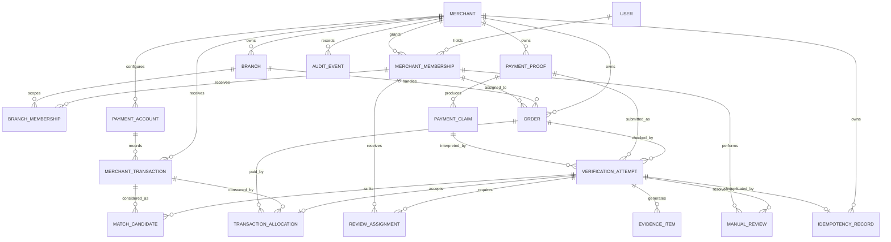

# ProofPay — Data Model

## 1. Purpose

This document defines the logical relational data model for the ProofPay hackathon MVP.

It is derived from the product overview and system design, especially the following rules:

- a screenshot is an untrusted payment claim;
- a merchant-side transaction is the source of truth;
- facts, derived evidence, and decisions are stored separately;
- every merchant-owned record is tenant-scoped;
- delivery riders and other verifiers can verify assigned orders without browsing the merchant's transaction feed;
- transaction consumption and idempotency are enforced by database constraints;
- decisions remain reproducible through component and rule versions.

The model is relational and framework-agnostic. PostgreSQL-style types are illustrative rather than an ORM contract.

---

## 2. Modeling Conventions

### 2.1 Identifiers

- Primary keys use UUIDs.
- Foreign keys use the referenced entity name followed by `_id`.
- External provider identifiers are stored separately from internal IDs.
- Public API identifiers may use the same UUIDs or an additional opaque public ID.

### 2.2 Money

- Monetary values use integer minor units, such as paisa, in `BIGINT` columns.
- Floating-point types are prohibited for payment amounts.
- Currency uses an ISO 4217 code such as `PKR`.
- `order_amount`, `claimed_amount`, and `transaction_amount` remain separate facts.

### 2.3 Time

- Persisted timestamps use UTC-capable `TIMESTAMPTZ` values.
- Source timezone and parsing assumptions are retained when a screenshot timestamp is uncertain.
- Business comparisons use normalized UTC values without discarding the original extracted text.

### 2.4 Immutability

Source facts and generated evidence are append-only wherever practical.

Corrections create a new claim, review, allocation event, or audit event instead of silently replacing historical evidence.

### 2.5 Tenant Isolation

Every merchant-owned table contains `merchant_id`, including tables where the merchant could be inferred through another relationship.

This deliberate duplication supports simple authorization predicates, composite foreign keys, indexes, and future row-level security. Every merchant-owned parent table exposes `UNIQUE (merchant_id, id)`, and tenant-owned child references use both columns rather than a single-column foreign key.

---

## 3. Relationship Overview



### 3.1 Primary Aggregate Paths

```text
Merchant → Order → Verification Attempt → Evidence → Decision
Merchant → Payment Account → Merchant Transaction → Allocation
Merchant → Payment Proof → Payment Claim → Verification Attempt
User → Merchant Membership → Branch/Order/Review Scope
```

---

## 4. Identity and Authorization Entities

### 4.1 `users`

Represents a human identity independent of any merchant.

| Field | Type | Required | Notes |
|---|---|---:|---|
| `id` | UUID | Yes | Primary key |
| `email` | VARCHAR | Yes | Normalized, globally unique |
| `password_hash` | VARCHAR | Conditional | Omitted when external identity is used |
| `display_name` | VARCHAR | Yes | User-facing name |
| `status` | ENUM | Yes | `ACTIVE`, `SUSPENDED`, `DISABLED` |
| `last_login_at` | TIMESTAMPTZ | No | Security and support metadata |
| `created_at` | TIMESTAMPTZ | Yes | Creation time |
| `updated_at` | TIMESTAMPTZ | Yes | Last profile change |

Passwords or provider tokens are never stored in plaintext.

### 4.2 `merchants`

Represents one isolated ProofPay tenant.

| Field | Type | Required | Notes |
|---|---|---:|---|
| `id` | UUID | Yes | Primary key and tenant identifier |
| `name` | VARCHAR | Yes | Legal or display name |
| `default_currency` | CHAR(3) | Yes | MVP default: `PKR` |
| `default_timezone` | VARCHAR | Yes | IANA timezone, such as `Asia/Karachi` |
| `status` | ENUM | Yes | `ACTIVE`, `SUSPENDED`, `CLOSED` |
| `created_at` | TIMESTAMPTZ | Yes | Creation time |
| `updated_at` | TIMESTAMPTZ | Yes | Last settings change |

### 4.3 `merchant_memberships`

Connects a user to a merchant and defines the user's base role.

Authorization uses the membership, not `users.id` alone.

| Field | Type | Required | Notes |
|---|---|---:|---|
| `id` | UUID | Yes | Primary key |
| `merchant_id` | UUID | Yes | FK → `merchants.id` |
| `user_id` | UUID | Yes | FK → `users.id` |
| `role` | ENUM | Yes | `MERCHANT_ADMIN`, `MANAGER`, `VERIFIER`, `REVIEWER` |
| `scope_mode` | ENUM | Yes | `MERCHANT_WIDE`, `BRANCHES`, `ASSIGNED_RESOURCES` |
| `status` | ENUM | Yes | `INVITED`, `ACTIVE`, `SUSPENDED`, `REVOKED` |
| `invited_by_membership_id` | UUID | No | Self-FK for auditability |
| `created_at` | TIMESTAMPTZ | Yes | Membership creation |
| `updated_at` | TIMESTAMPTZ | Yes | Role/status change |

Constraint: `UNIQUE (merchant_id, user_id)`.

Admins are merchant-wide, managers may be merchant-wide or branch-scoped, and verifiers/reviewers are resource-assigned.

### 4.4 `branches`

Represents an optional merchant location or operating unit.

| Field | Type | Required | Notes |
|---|---|---:|---|
| `id` | UUID | Yes | Primary key |
| `merchant_id` | UUID | Yes | Tenant owner |
| `name` | VARCHAR | Yes | Branch name |
| `code` | VARCHAR | No | Merchant-defined short code |
| `status` | ENUM | Yes | `ACTIVE`, `INACTIVE` |
| `created_at` | TIMESTAMPTZ | Yes | Creation time |

Constraint: `UNIQUE (merchant_id, code)` when `code` is present.

### 4.5 `branch_memberships`

Scopes managers or other staff to one or more branches.

| Field | Type | Required | Notes |
|---|---|---:|---|
| `merchant_id` | UUID | Yes | Tenant owner |
| `branch_id` | UUID | Yes | FK → `branches.id` |
| `membership_id` | UUID | Yes | FK → `merchant_memberships.id` |
| `created_at` | TIMESTAMPTZ | Yes | Assignment time |

Primary key: `(branch_id, membership_id)`.

All three records must belong to the same merchant.

---

## 5. Commerce and Trusted Transaction Entities

### 5.1 `orders`

Represents the sale or delivery whose payment is being verified.

| Field | Type | Required | Notes |
|---|---|---:|---|
| `id` | UUID | Yes | Primary key |
| `merchant_id` | UUID | Yes | Tenant owner |
| `branch_id` | UUID | No | Operational branch |
| `external_order_ref` | VARCHAR | No | Merchant/POS order identifier |
| `customer_reference` | VARCHAR | No | Minimal merchant-defined customer/order reference |
| `expected_amount_minor` | BIGINT | Yes | Amount required from the customer |
| `currency` | CHAR(3) | Yes | Must match verification currency |
| `status` | ENUM | Yes | `PENDING_PAYMENT`, `PAYMENT_REVIEW`, `PAID`, `CANCELLED` |
| `assigned_verifier_membership_id` | UUID | No | Rider/verifier permitted to submit proof |
| `created_at` | TIMESTAMPTZ | Yes | Order creation |
| `updated_at` | TIMESTAMPTZ | Yes | Last state change |

Constraint: `UNIQUE (merchant_id, external_order_ref)` when the reference is present.

The assigned verifier may access this order and its permitted verification projection, not the merchant's full transaction feed.

### 5.2 `payment_accounts`

Represents a merchant receiving account or wallet without storing login credentials.

| Field | Type | Required | Notes |
|---|---|---:|---|
| `id` | UUID | Yes | Primary key |
| `merchant_id` | UUID | Yes | Tenant owner |
| `provider_code` | VARCHAR | Yes | Examples: `easypaisa`, `jazzcash`, `raast`, `bank` |
| `display_name` | VARCHAR | Yes | Merchant-facing label |
| `masked_account_ref` | VARCHAR | No | Masked account/IBAN/mobile reference |
| `status` | ENUM | Yes | `ACTIVE`, `DISABLED` |
| `created_at` | TIMESTAMPTZ | Yes | Creation time |

No bank password, wallet PIN, or full secret credential belongs in this table.

### 5.3 `merchant_transactions`

Represents normalized merchant-side evidence that money was received.

| Field | Type | Required | Notes |
|---|---|---:|---|
| `id` | UUID | Yes | Primary key |
| `merchant_id` | UUID | Yes | Tenant owner |
| `payment_account_id` | UUID | Yes | FK → `payment_accounts.id`; demo imports use a demo account |
| `provider_code` | VARCHAR | Yes | Normalized provider |
| `external_transaction_id` | VARCHAR | Yes | Provider transaction reference |
| `amount_minor` | BIGINT | Yes | Trusted transaction amount |
| `currency` | CHAR(3) | Yes | Usually `PKR` for MVP |
| `sender_name` | VARCHAR | No | Normalized sender label |
| `sender_reference` | VARCHAR | No | Masked account/mobile reference |
| `receiver_name` | VARCHAR | No | Merchant/receiver label |
| `occurred_at` | TIMESTAMPTZ | Yes | Provider transaction time |
| `status` | ENUM | Yes | `POSTED`, `PENDING`, `REVERSED` |
| `source_type` | ENUM | Yes | `PROVIDER`, `WEBHOOK`, `CSV`, `MANUAL`, `DEMO` |
| `trust_level` | ENUM | Yes | `TRUSTED`, `PARTIAL`, `DEMO_TRUSTED` |
| `source_payload` | JSONB | No | Redacted provider payload for audit/debugging |
| `ingested_at` | TIMESTAMPTZ | Yes | ProofPay ingestion time |
| `created_at` | TIMESTAMPTZ | Yes | Record creation |

Only a sufficiently trusted transaction with `POSTED` status can support `VERIFIED`.

Constraint: `UNIQUE (merchant_id, provider_code, payment_account_id, external_transaction_id)`.

---

## 6. Proof and Claim Entities

### 6.1 `payment_proofs`

Represents immutable metadata for an uploaded screenshot.

The binary image remains in private object storage.

| Field | Type | Required | Notes |
|---|---|---:|---|
| `id` | UUID | Yes | Primary key |
| `merchant_id` | UUID | Yes | Tenant owner |
| `uploaded_by_membership_id` | UUID | Yes | Uploading user membership |
| `storage_key` | VARCHAR | Yes | Private object-storage key |
| `media_type` | VARCHAR | Yes | Validated image MIME type |
| `byte_size` | BIGINT | Yes | Compressed upload size |
| `width_px` | INTEGER | Yes | Decoded width |
| `height_px` | INTEGER | Yes | Decoded height |
| `sha256_hash` | CHAR(64) | Yes | Exact duplicate detection |
| `perceptual_hash` | VARCHAR | No | Similar-image detection |
| `retention_status` | ENUM | Yes | `ACTIVE`, `PENDING_DELETE`, `DELETED` |
| `uploaded_at` | TIMESTAMPTZ | Yes | Upload time |
| `deleted_at` | TIMESTAMPTZ | No | Retention deletion time |

`storage_key` is unique and never acts as authorization evidence.

Exact and perceptual duplicate searches are always scoped by `merchant_id` in the MVP.

### 6.2 `payment_claims`

Represents one parser's normalized interpretation of a proof.

Multiple immutable claims may exist for the same proof after reprocessing with a newer parser.

| Field | Type | Required | Notes |
|---|---|---:|---|
| `id` | UUID | Yes | Primary key |
| `merchant_id` | UUID | Yes | Tenant owner |
| `payment_proof_id` | UUID | Yes | FK → `payment_proofs.id` |
| `provider_code` | VARCHAR | No | Detected provider |
| `claimed_amount_minor` | BIGINT | No | Screenshot amount claim |
| `currency` | CHAR(3) | No | Parsed/default currency |
| `sender_name` | VARCHAR | No | Extracted sender |
| `receiver_name` | VARCHAR | No | Extracted receiver |
| `external_transaction_id` | VARCHAR | No | Extracted transaction reference |
| `claimed_occurred_at` | TIMESTAMPTZ | No | Parsed screenshot time |
| `timestamp_raw` | VARCHAR | No | Original timestamp text |
| `timezone_assumption` | VARCHAR | No | Assumption used for normalization |
| `field_confidences` | JSONB | Yes | Confidence by canonical field |
| `raw_ocr_text` | TEXT | No | Sensitive; restricted and retention-controlled |
| `provider_template` | VARCHAR | No | Detected receipt template |
| `parser_version` | VARCHAR | Yes | Parser/model version |
| `created_at` | TIMESTAMPTZ | Yes | Extraction completion time |

Claim values are derived and never treated as trusted payment facts.

---

## 7. Verification and Evidence Entities

### 7.1 `verification_attempts`

Represents one orchestration run and its persisted decision.

| Field | Type | Required | Notes |
|---|---|---:|---|
| `id` | UUID | Yes | Primary key |
| `merchant_id` | UUID | Yes | Tenant owner |
| `order_id` | UUID | No | FK → `orders.id` |
| `payment_proof_id` | UUID | Yes | FK → `payment_proofs.id` |
| `payment_claim_id` | UUID | No | Claim selected for this run |
| `requested_by_membership_id` | UUID | Yes | Initiating user membership |
| `lifecycle_status` | ENUM | Yes | `RECEIVED`, `VALIDATING`, `PROCESSING`, `DECIDED`, `REVIEWED`, `FAILED` |
| `decision_status` | ENUM | No | `VERIFIED`, `UNMATCHED`, `SUSPICIOUS`, `DUPLICATE`, `NEEDS_REVIEW` |
| `risk_level` | ENUM | No | `LOW`, `MEDIUM`, `HIGH` |
| `decision_confidence` | NUMERIC | No | Optional calibrated score, internal only |
| `selected_transaction_id` | UUID | No | Best trusted candidate, if any |
| `rule_set_version` | VARCHAR | No | Decision rules used |
| `summary_reason_code` | VARCHAR | No | Primary explanation code |
| `failure_code` | VARCHAR | No | Processing failure classification |
| `failure_detail` | TEXT | No | Sanitized operational detail |
| `started_at` | TIMESTAMPTZ | No | Processing start |
| `decided_at` | TIMESTAMPTZ | No | Decision persistence time |
| `created_at` | TIMESTAMPTZ | Yes | Attempt creation |
| `updated_at` | TIMESTAMPTZ | Yes | Lifecycle update |

`decision_status` is null until a decision exists. `FAILED` is a lifecycle outcome, not a payment decision.

When an order is present, amount evaluation compares its expected amount with the selected claim and trusted transaction.

### 7.2 `match_candidates`

Stores ranked transaction candidates considered by the matcher.

| Field | Type | Required | Notes |
|---|---|---:|---|
| `id` | UUID | Yes | Primary key |
| `merchant_id` | UUID | Yes | Tenant owner |
| `verification_attempt_id` | UUID | Yes | FK → `verification_attempts.id` |
| `merchant_transaction_id` | UUID | Yes | FK → `merchant_transactions.id` |
| `rank` | INTEGER | Yes | Rank within the attempt |
| `aggregate_score` | NUMERIC | Yes | Internal candidate score |
| `field_scores` | JSONB | Yes | ID, amount, time, sender, receiver, provider scores |
| `critical_conflicts` | JSONB | Yes | Typed conflict reason codes |
| `matcher_version` | VARCHAR | Yes | Matching implementation/configuration |
| `selected` | BOOLEAN | Yes | True only for chosen candidate |
| `created_at` | TIMESTAMPTZ | Yes | Scoring time |

Constraints:

- `UNIQUE (verification_attempt_id, merchant_transaction_id)`;
- `UNIQUE (verification_attempt_id, rank)`;
- partial unique index on `verification_attempt_id` where `selected = TRUE`.

Scores and ranked candidates are never exposed to a `VERIFIER`.

### 7.3 `evidence_items`

Stores typed observations consumed by the decision engine.

| Field | Type | Required | Notes |
|---|---|---:|---|
| `id` | UUID | Yes | Primary key |
| `merchant_id` | UUID | Yes | Tenant owner |
| `verification_attempt_id` | UUID | Yes | Parent attempt |
| `evidence_code` | VARCHAR | Yes | Examples: `AMOUNT_MATCH`, `UNDERPAID`, `TRANSACTION_REUSED` |
| `outcome` | ENUM | Yes | `PASS`, `FAIL`, `WARNING`, `UNKNOWN` |
| `observed_value` | JSONB | No | Actual/derived value |
| `expected_value` | JSONB | No | Expected comparison value |
| `score` | NUMERIC | No | Component confidence or similarity |
| `details` | JSONB | No | Regions, distances, and safe metadata |
| `source_component` | VARCHAR | Yes | OCR, matcher, duplicate, tamper, decision |
| `component_version` | VARCHAR | Yes | Reproducibility metadata |
| `created_at` | TIMESTAMPTZ | Yes | Evidence creation |

Important amount reason codes include:

- `AMOUNT_MATCH`;
- `UNDERPAID`;
- `CLAIMED_AMOUNT_INFLATED`;
- `OVERPAYMENT_REVIEW`;
- `CLAIM_UNDERSTATED`.

Other core codes include transaction found/not found, ID match, sender similarity, timestamp distance, exact proof reuse, perceptual proof similarity, and analyzer unavailable.

### 7.4 `transaction_allocations`

Atomically records that a trusted transaction has been consumed by an accepted payment.

| Field | Type | Required | Notes |
|---|---|---:|---|
| `id` | UUID | Yes | Primary key |
| `merchant_id` | UUID | Yes | Tenant owner |
| `merchant_transaction_id` | UUID | Yes | Consumed transaction |
| `order_id` | UUID | Yes | Paid order |
| `verification_attempt_id` | UUID | Yes | Accepting attempt |
| `status` | ENUM | Yes | `ACTIVE`, `RELEASED` |
| `allocated_at` | TIMESTAMPTZ | Yes | Acceptance time |
| `released_at` | TIMESTAMPTZ | No | Controlled reversal time |
| `released_by_membership_id` | UUID | No | Authorized actor |
| `release_reason` | VARCHAR | No | Required when released |

MVP constraints:

- partial unique index on `merchant_transaction_id` where `status = 'ACTIVE'`;
- partial unique index on `order_id` where `status = 'ACTIVE'`;
- transaction, order, attempt, and allocation must share `merchant_id`.
- composite FK `(merchant_id, verification_attempt_id, merchant_transaction_id)` → `verification_attempts (merchant_id, id, selected_transaction_id)`.

The parent attempt exposes `UNIQUE (merchant_id, id, selected_transaction_id)`. This makes an allocation impossible unless its transaction equals the attempt's selected transaction.

Release fields are enforced together:

```sql
CHECK (
  (status = 'ACTIVE'
    AND released_at IS NULL
    AND released_by_membership_id IS NULL
    AND release_reason IS NULL)
  OR
  (status = 'RELEASED'
    AND released_at IS NOT NULL
    AND released_by_membership_id IS NOT NULL
    AND release_reason IS NOT NULL)
)
```

Allocation creation occurs in the same database transaction as the final `VERIFIED` decision.

---

## 8. Review, Idempotency, and Audit Entities

### 8.1 `review_assignments`

Assigns a reviewable attempt without granting access to unrelated merchant data.

| Field | Type | Required | Notes |
|---|---|---:|---|
| `id` | UUID | Yes | Primary key |
| `merchant_id` | UUID | Yes | Tenant owner |
| `verification_attempt_id` | UUID | Yes | Attempt requiring review |
| `reviewer_membership_id` | UUID | Yes | Assigned `REVIEWER`/manager |
| `status` | ENUM | Yes | `OPEN`, `IN_PROGRESS`, `COMPLETED`, `CANCELLED` |
| `assigned_at` | TIMESTAMPTZ | Yes | Assignment time |
| `completed_at` | TIMESTAMPTZ | No | Completion time |

Constraint: partial unique index on `verification_attempt_id` where `status IN ('OPEN', 'IN_PROGRESS')`. Parallel review requires an explicit future schema change.

### 8.2 `manual_reviews`

Records a human review or controlled decision override.

| Field | Type | Required | Notes |
|---|---|---:|---|
| `id` | UUID | Yes | Primary key |
| `merchant_id` | UUID | Yes | Tenant owner |
| `verification_attempt_id` | UUID | Yes | Reviewed attempt |
| `reviewer_membership_id` | UUID | Yes | Acting reviewer |
| `previous_decision_status` | ENUM | No | Automated decision |
| `review_outcome` | ENUM | Yes | `UPHELD`, `OVERRIDDEN`, `MORE_EVIDENCE_REQUIRED` |
| `new_decision_status` | ENUM | No | Required for override |
| `reason_code` | VARCHAR | Yes | Structured review reason |
| `notes` | TEXT | No | Restricted free text |
| `created_at` | TIMESTAMPTZ | Yes | Review time |

A review does not mutate historical evidence. It adds a new accountable human decision.

### 8.3 `idempotency_records`

Binds a client idempotency key to one request fingerprint and attempt.

| Field | Type | Required | Notes |
|---|---|---:|---|
| `id` | UUID | Yes | Primary key |
| `merchant_id` | UUID | Yes | Tenant owner |
| `idempotency_key` | VARCHAR | Yes | Client-supplied opaque key |
| `request_fingerprint` | CHAR(64) | Yes | Hash of decision-relevant canonical request |
| `verification_attempt_id` | UUID | Yes | Created/reused attempt |
| `created_at` | TIMESTAMPTZ | Yes | Key creation |
| `expires_at` | TIMESTAMPTZ | Yes | MVP default: 24 hours |

Constraint: `UNIQUE (merchant_id, idempotency_key)`.

Behavior:

- same key and fingerprint returns the existing attempt;
- same key and different fingerprint returns `409 IDEMPOTENCY_CONFLICT`;
- concurrent identical requests converge on one row and one attempt.

### 8.4 `audit_events`

Stores append-only security and decision-history events.

| Field | Type | Required | Notes |
|---|---|---:|---|
| `id` | UUID | Yes | Primary key |
| `merchant_id` | UUID | Yes | Tenant owner |
| `actor_membership_id` | UUID | No | Null for trusted system actions |
| `event_type` | VARCHAR | Yes | Structured event code |
| `resource_type` | VARCHAR | Yes | Entity category |
| `resource_id` | UUID | No | Affected entity |
| `request_id` | VARCHAR | No | Correlation identifier |
| `ip_hash` | VARCHAR | No | Privacy-aware abuse correlation |
| `metadata` | JSONB | Yes | Redacted event details |
| `created_at` | TIMESTAMPTZ | Yes | Event time |

Examples include proof upload, transaction ingestion, verification decision, duplicate conflict, manual override, denied access, idempotency conflict, and rate-limit activation.

Audit metadata must not contain screenshots, access tokens, full OCR text, passwords, or unnecessary personal information.

---

## 9. Enumerations

Logical enums may be implemented as database enums, checked strings, or lookup tables.

| Enum | Values |
|---|---|
| Membership role | `MERCHANT_ADMIN`, `MANAGER`, `VERIFIER`, `REVIEWER` |
| Membership scope | `MERCHANT_WIDE`, `BRANCHES`, `ASSIGNED_RESOURCES` |
| Attempt lifecycle | `RECEIVED`, `VALIDATING`, `PROCESSING`, `DECIDED`, `REVIEWED`, `FAILED` |
| Verification decision | `VERIFIED`, `UNMATCHED`, `SUSPICIOUS`, `DUPLICATE`, `NEEDS_REVIEW` |
| Evidence outcome | `PASS`, `FAIL`, `WARNING`, `UNKNOWN` |
| Risk level | `LOW`, `MEDIUM`, `HIGH` |
| Transaction status | `POSTED`, `PENDING`, `REVERSED` |
| Transaction trust | `TRUSTED`, `PARTIAL`, `DEMO_TRUSTED` |
| Allocation status | `ACTIVE`, `RELEASED` |

Application and database validation must reject unknown decision and lifecycle values.

---

## 10. Critical Constraints and Invariants

### 10.1 Tenant Consistency

All related merchant-owned rows must share the same `merchant_id`.

Every merchant-owned parent table defines `UNIQUE (merchant_id, id)`. The following composite foreign keys make tenant consistency a database invariant:

| Child reference | Parent key |
|---|---|
| `merchant_memberships (merchant_id, invited_by_membership_id)` | `merchant_memberships (merchant_id, id)` |
| `branch_memberships (merchant_id, branch_id)` | `branches (merchant_id, id)` |
| `branch_memberships (merchant_id, membership_id)` | `merchant_memberships (merchant_id, id)` |
| `orders (merchant_id, branch_id)` | `branches (merchant_id, id)` |
| `orders (merchant_id, assigned_verifier_membership_id)` | `merchant_memberships (merchant_id, id)` |
| `merchant_transactions (merchant_id, payment_account_id)` | `payment_accounts (merchant_id, id)` |
| `payment_proofs (merchant_id, uploaded_by_membership_id)` | `merchant_memberships (merchant_id, id)` |
| `payment_claims (merchant_id, payment_proof_id)` | `payment_proofs (merchant_id, id)` |
| `verification_attempts (merchant_id, order_id)` | `orders (merchant_id, id)` |
| `verification_attempts (merchant_id, payment_proof_id)` | `payment_proofs (merchant_id, id)` |
| `verification_attempts (merchant_id, payment_claim_id)` | `payment_claims (merchant_id, id)` |
| `verification_attempts (merchant_id, requested_by_membership_id)` | `merchant_memberships (merchant_id, id)` |
| `verification_attempts (merchant_id, selected_transaction_id)` | `merchant_transactions (merchant_id, id)` |
| `match_candidates (merchant_id, verification_attempt_id)` | `verification_attempts (merchant_id, id)` |
| `match_candidates (merchant_id, merchant_transaction_id)` | `merchant_transactions (merchant_id, id)` |
| `evidence_items (merchant_id, verification_attempt_id)` | `verification_attempts (merchant_id, id)` |
| `transaction_allocations (merchant_id, merchant_transaction_id)` | `merchant_transactions (merchant_id, id)` |
| `transaction_allocations (merchant_id, order_id)` | `orders (merchant_id, id)` |
| `transaction_allocations (merchant_id, verification_attempt_id)` | `verification_attempts (merchant_id, id)` |
| `transaction_allocations (merchant_id, released_by_membership_id)` | `merchant_memberships (merchant_id, id)` |
| `review_assignments (merchant_id, verification_attempt_id)` | `verification_attempts (merchant_id, id)` |
| `review_assignments (merchant_id, reviewer_membership_id)` | `merchant_memberships (merchant_id, id)` |
| `manual_reviews (merchant_id, verification_attempt_id)` | `verification_attempts (merchant_id, id)` |
| `manual_reviews (merchant_id, reviewer_membership_id)` | `merchant_memberships (merchant_id, id)` |
| `idempotency_records (merchant_id, verification_attempt_id)` | `verification_attempts (merchant_id, id)` |
| `audit_events (merchant_id, actor_membership_id)` | `merchant_memberships (merchant_id, id)` |

Nullable references remain nullable as a pair: the resource ID may be null, but a non-null resource ID always participates with `merchant_id` in its composite FK. Polymorphic `audit_events.resource_id` is the intentional exception and is validated by the audit writer.

### 10.2 Verification Safety

- `VERIFIED` requires a selected `POSTED` transaction with sufficient trust.
- `VERIFIED` requires all critical amount rules to pass.
- `VERIFIED` requires an active transaction allocation.
- A screenshot-derived signal cannot independently create an allocation.
- A failed mandatory duplicate check cannot produce `VERIFIED`.

### 10.3 Allocation Safety

- Only one active allocation may consume a transaction.
- Only one active allocation may pay an MVP order.
- For every allocation, `merchant_transaction_id` equals its attempt's `selected_transaction_id` through the composite FK defined in §7.4.
- Allocation and decision persistence occur atomically.
- Releasing an allocation requires an authorized actor, reason, and audit event.

### 10.4 Authorization Safety

- A `VERIFIER` can query only assigned orders and their projected verification results.
- A `VERIFIER` cannot list `merchant_transactions` or `match_candidates`.
- A `REVIEWER` can access only assigned review attempts.
- Managers are constrained by branch membership unless granted merchant-wide scope.
- Admin access remains tenant-scoped.

### 10.5 Evidence Integrity

- Evidence records are append-only.
- Every evidence item includes its source component and version.
- Every decision includes the rule-set version used.
- Reprocessing creates a new claim or attempt rather than rewriting the old one.

---

## 11. Indexing Strategy

### 11.1 Authorization and Listing

- `merchant_memberships (merchant_id, user_id)` unique;
- `orders (merchant_id, assigned_verifier_membership_id, status)`;
- `review_assignments (merchant_id, reviewer_membership_id, status)`;
- every merchant-owned primary access path begins with `merchant_id`.

### 11.2 Transaction Candidate Retrieval

- unique index on `(merchant_id, provider_code, payment_account_id, external_transaction_id)`;
- lookup index on `(merchant_id, provider_code, external_transaction_id)` for reliable-ID retrieval when the receiving account is unknown;
- lookup index on `(merchant_id, provider_code, payment_account_id, occurred_at)` for account-scoped ±30-minute retrieval;
- index on `(merchant_id, provider_code, occurred_at)`;
- index on `(merchant_id, provider_code, amount_minor, occurred_at)`;
- index on `(merchant_id, payment_account_id, status, occurred_at)`.

Exact transaction ID lookup does not depend on the screenshot timestamp or amount.

### 11.3 Verification and Review

- `verification_attempts (merchant_id, created_at DESC)`;
- `verification_attempts (merchant_id, order_id, created_at DESC)`;
- `verification_attempts (merchant_id, decision_status, created_at DESC)`;
- `evidence_items (verification_attempt_id, evidence_code)`;
- partial unique index on `review_assignments (verification_attempt_id)` where status is `OPEN` or `IN_PROGRESS`.

### 11.4 Duplicate Detection

- `payment_proofs (merchant_id, sha256_hash)`;
- `payment_proofs (merchant_id, uploaded_at DESC)` for bounded perceptual scans;
- a specialized perceptual-hash index is deferred until measured volume justifies it.

Cross-merchant duplicate indexing is intentionally excluded from the MVP.

---

## 12. Transaction Boundaries

### 12.1 Create Verification

The following database actions should be one transaction after the proof object is stored:

1. claim the idempotency key;
2. create the `payment_proofs` metadata row;
3. create the `verification_attempts` row;
4. bind the idempotency record to the attempt.

If object storage succeeds but the database transaction fails, the object is marked for compensating cleanup.

### 12.2 Persist Decision

The following actions should be atomic:

1. persist match candidates and evidence;
2. set the selected transaction and decision;
3. create the allocation when the decision is `VERIFIED`;
4. update the order to `PAID` when applicable;
5. create the decision audit event.

A uniqueness conflict on allocation converts the attempt to `DUPLICATE`; the application must retry decision persistence using the winning allocation as evidence.

### 12.3 Manual Review

Review completion, any resulting decision override, allocation creation/release, order-state change, and audit event should commit together.

---

## 13. Data Visibility

| Data | Admin | Manager | Verifier/Rider | Reviewer |
|---|---:|---:|---:|---:|
| Full merchant transaction feed | Yes | Scoped | No | No |
| Assigned order | Yes | Scoped | Yes | When part of review |
| Upload proof | Yes | Scoped | Assigned order only | No |
| Verification decision | Yes | Scoped | Assigned order only | Assigned case |
| Raw match scores/candidates | Restricted | Restricted | No | When required |
| Masked matched reference | Yes | Yes | Optional | Yes |
| User and role management | Yes | No | No | No |

The database stores complete internal evidence, while API projections enforce least-privilege visibility.

Client-side hiding is never treated as authorization.

---

## 14. Retention and Deletion

- Screenshot objects and `payment_proofs` follow a merchant-configurable retention policy.
- Deletion first marks a proof `PENDING_DELETE`, removes the object, then records `DELETED`.
- Verification facts and audit events may outlive the screenshot using redacted metadata, subject to policy and law.
- Raw OCR text should have a shorter retention period than normalized fields where practical.
- Merchant closure triggers a controlled tenant-deletion workflow rather than unrestricted cascading deletion.
- Hashes used for duplicate detection are deleted or anonymized with the proof according to policy.

---

## 15. MVP Simplifications and Evolution

The MVP intentionally assumes:

- one currency per order and transaction;
- one accepted transaction per order;
- no split payments or partial allocations;
- no refunds or settlement ledger;
- transaction imports through a simulator, manual entry, or controlled file import;
- perceptual duplicate searches within one merchant only;
- rate-limit evaluation from recent attempts/audit events or a simple ephemeral counter.

Future versions may add split-payment allocations, refunds, provider webhook events, ingestion batches, ledger entries, partitioned history, and a privacy-reviewed cross-merchant fraud-signal service.

Those additions should extend the existing facts/evidence/decision boundaries rather than change the fundamental trust model.
