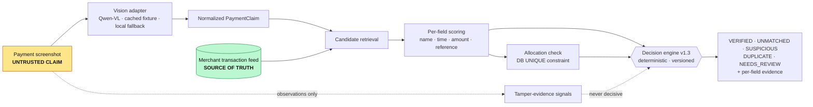

# Phase 6 — Demo, Deployment and Pitch — Best Practices

> **Thesis.** Phases 1–5 produced a system. Phase 6 produces the only three things a judge will ever actually touch: **a 3-minute video, a README, and 4 minutes of you talking**. A judge will spend more time on your README than on your decision engine. Budget accordingly. The failure mode of a strong engineering team is treating Phase 6 as "wrap-up" — it is a separate deliverable with its own definition of done, and it needs 20–25% of total project time.

---

## 1. What hackathon judges actually score

### 1.1 Real, current rubrics

| Event | Criteria and weights | Source |
|---|---|---|
| **Global AI Hackathon Series with Qwen Cloud** (Alibaba Cloud, 2026) | Innovation & AI Creativity **30%**, Technical Depth & Engineering **30%**, Problem Value & Impact **25%**, Presentation & Documentation **15%** | [Devpost rules](https://qwencloud-hackathon.devpost.com/rules) |
| **Alibaba Cloud × Atlas Agentic AI Hackathon** (2026) | Innovation **30%**, Feasibility **30%**, Platform use **20%**, Demo Presentation **20%** | [AISEA event page](https://www.aisea.builders/en/events/61044c03-9689-4550-8926-6dc947c9521f) |
| **Bano Qabil × Alibaba Cloud AI Hackathon Pakistan 2026** | Impact of the problem solved · Creative use of AI tools · Practical viability (no published numeric weights) | [Alkhidmat event page](https://alkhidmat.org/get-involved/events/alkhidmat-ai-hackathon-event) |
| **MLH standard** | Technology · Design · Completion · Idea — **weighted equally** | [MLH policies](https://github.com/MLH/mlh-policies/blob/main/standard-hackathon-rules.md) |
| **AI Builders Hackathon 2026** (Devpost) | Technical Implementation 25%, Problem Solving & Impact 25%, Innovation 20%, UX & Design 15%, Presentation & Demo 15% | [Devpost](https://ai-builders-hackathon-2026.devpost.com/) |
| **The Merge 2026** (Devpost) | Impact 30%, Creativity 25%, Process & Learning 20%, Design & Usability 15% | [Devpost](https://the-merge-2026-hackathon.devpost.com/) |

**A structural fact worth knowing:** Devpost's *online* judging platform "does not currently support varying weights in criteria" — if judging happens on-platform, every criterion is equally weighted regardless of what the rules page implies ([Devpost help](https://help.devpost.com/article/64-judging-public-voting)). Assume equal weighting unless the event says judging is offline.

### 1.2 The distilled picture

Across every rubric above, the same four buckets appear. Take the median weights:

- **Innovation / originality — ~27%**
- **Technical depth / implementation — ~28%**
- **Impact / problem value / feasibility — ~26%**
- **Presentation & documentation — ~17%**

### 1.3 What this implies about the last 24 hours

The trap: engineers read "Technical Depth 30%" and keep coding. That is wrong, for a mechanical reason.

**Presentation is not one bucket — it is the transport layer for all four.** A judge cannot score your technical depth from code they will not read; they score it from what you say and what your README claims. So the effective allocation is:

| Bucket | Weight | How the judge *actually* forms the score |
|---|---|---|
| Presentation & docs | ~17% | Directly observed. You control it completely. |
| Technical depth | ~28% | Inferred from README architecture section + 30 seconds of your answer to one hard question. |
| Innovation | ~27% | Inferred from a single differentiating sentence you say out loud. |
| Impact / feasibility | ~26% | Inferred from your problem framing and one credible number. |

**Rule: in the last 24 hours, no work is allowed that does not change what a judge sees or hears.** The only exception is fixing a demo-path bug.

Concretely, for ProofPay, the last-24-hour ledger should look like:

| Hours | Activity |
|---|---|
| 6 h | Demo mode + fixtures + seeded demo data, made bulletproof |
| 4 h | README, architecture diagram, THIRD_PARTY_NOTICES, LICENSE, AI disclosure |
| 3 h | Record and edit the demo video |
| 3 h | Deploy + warm + verify the public URLs |
| 4 h | Rehearsal (five full runs) and Q&A drilling |
| 2 h | Submission, buffer |
| 2 h | Sleep is a deliverable |

**Anti-pattern:** "We'll write the README after the code freeze." The README is what forces you to discover that your architecture story has a hole in it. Draft it at T-36h, not T-6h.

---

## 2. Demo structure for a 3–5 minute slot

### 2.1 The beat sheet

Two versions. Build the 3-minute one first (Qwen Cloud rules cap the video at **under 3 minutes**, and note "Judges are not required to watch beyond three minutes"); the 5-minute live version is the 3-minute one with breathing room.

| Beat | 3:00 video | 5:00 live | What happens |
|---|---|---|---|
| **Cold open — the failure** | 0:00–0:25 | 0:00–0:35 | A tampered screenshot goes in. The system flags it. No preamble, no title card longer than 3 seconds. |
| **Problem + stakes** | 0:25–0:50 | 0:35–1:10 | Now that they've seen it, name the problem and who bleeds. |
| **The reframe (differentiator #1)** | 0:50–1:10 | 1:10–1:35 | "The screenshot is a claim. The bank record is truth." |
| **Live demo, main body** | 1:10–2:15 | 1:35–3:20 | Duplicate → verified → underpayment. Evidence panel each time. |
| **Architecture / technical depth** | 2:15–2:35 | 3:20–4:05 | 20–40 seconds. One diagram. Name the three things that are hard. |
| **Close + ask** | 2:35–2:55 | 4:05–4:40 | Impact number, what's next, team. |
| **Buffer** | — | 4:40–5:00 | Never use it. Finishing early is a signal of control. |

Overrunning is the single most-cited scoring sin: "By keeping within the time, you tell the jury, 'I am serious about this'" ([David Beckett, How to Win a Hackathon Pitch](https://www.linkedin.com/pulse/how-win-hackathon-pitch-david-beckett)).

### 2.2 Why open on the failure case, not the happy path

Four independent reasons, in order of strength:

1. **The happy path is indistinguishable from a stub.** A judge watching a screenshot go in and "VERIFIED" come out cannot tell whether you built a reconciliation engine or an `if True: return "VERIFIED"`. A judge watching a *tampered* screenshot get caught, with a per-field evidence breakdown showing exactly *which* field failed, has just been shown that real logic exists. **The failure case is the only case that proves the system is real.**
2. **Judges explicitly want the pain shared.** "You need to get your audience of judges sharing your frustration" ([JetBrains, *How to Win a Hackathon: Notes From the Judging Table*, June 2026](https://blog.jetbrains.com/ai/2026/06/how-to-win-a-hackathon-notes-from-the-judging-table/)). Showing the fraud *succeeding against a human* for 8 seconds, then failing against ProofPay, does that faster than any slide.
3. **It sets up your differentiator before you state it.** By the time you say "the screenshot is a claim, not proof," they have already watched a claim get rejected. The sentence lands as a summary of what they saw, not as a thesis to be evaluated.
4. **It inoculates against the killer question.** If you open happy-path, the first judge question is "what if it's fake?" and you are now on the back foot. Open on the fake and that question is pre-answered.

### 2.3 The demo sequence, in order, for ProofPay

Show **four states in ~65 seconds**. Do not show all five; `NEEDS_REVIEW` is the boring one — mention it, don't demo it.

| # | Fixture | State shown | The one sentence |
|---|---|---|---|
| 1 | `tampered_amount_12000.png` — amount edited from 1,200 to 12,000 | `SUSPICIOUS` | "The screenshot claims 12,000. The bank record for that reference says 1,200. We don't guess — we compare." |
| 2 | `reused_receipt.png` — a genuine screenshot for a txn already allocated | `DUPLICATE` | "This is a *real* screenshot. It's just already been spent. The uniqueness is a database constraint, not a heuristic." |
| 3 | `genuine_easypaisa.png` | `VERIFIED` | "And here's the boring case that makes it useful: matched on reference, amount, sender, timestamp. Merchant ships." |
| 4 | `underpayment_950.png` | `UNMATCHED` / underpayment | "Not fraud — an underpayment. The merchant needs a different action, so we give it a different state." |

Beat #2 is your strongest technical moment. Say the words "**database constraint**" out loud. A judge with a backend background will hear that and mentally add points to Technical Depth; it is the cheapest 30 seconds of credibility in the whole pitch.

Beat #4 is your strongest *product* moment: it proves you thought about the domain, not just the fraud demo.

### 2.4 Anti-patterns specific to this demo

- **Never say a percentage.** "87% likely fraud" invites "how did you validate that?" and you have no labelled dataset. Say "four of five fields disagree with the bank record" instead. Your architecture already commits to evidence breakdowns, not fraud scores — the pitch must match.
- **Never let the screenshot alone decide.** If a judge sees a state change that could have come only from image analysis, your whole positioning collapses. Every demo beat must visibly reference the merchant feed.
- **Don't narrate the UI** ("now I click upload, now it's loading…"). Narrate the *decision*.
- **Don't show JSON to non-technical judges** unless it's on screen for under 4 seconds as texture.
- **Don't demo the admin panel, the login, or the settings page.** Nobody scores those.
- **Don't apologise or pre-lower expectations** ("this is a bit rough, we didn't have time…"). Judges consistently rank this as the worst opening move ([PostHog, *24 tips for giving S-tier demos*](https://newsletter.posthog.com/p/how-to-demo)).

---

## 3. Live demo vs recorded video

### 3.1 The decision, with a recommendation

This is genuinely contested. Three positions exist in the literature:

- **Always live** — highest impact, highest risk.
- **Always recorded** — "presenting live was too risky… other teams suffered awkward silence as their web apps failed."
- **"Live-looking" staged demos** — deliberately scripted playback presented as if live ([utkusen](https://utkusen.substack.com/p/dont-do-live-demos-do-live-looking)).

**Recommendation: run genuinely live code against a local deterministic fixture path, and say so.** Reject the third option in its deceptive form. In a *judged competition* with an "original work" clause, presenting a scripted replay as a live run is a factual misrepresentation to judges, and if it's discovered during Q&A ("can I upload my own screenshot?") you lose everything. But the *engineering* of that option — determinism, no network, no latency — is exactly right.

The honest version is one sentence: **"This is running against a cached transaction feed and a cached vision response, so it works with the venue wifi down — the same code path runs against live DashScope and live Postgres, and I'll show you the config flag."** That sentence costs you 6 seconds and buys you total safety plus a credibility bump.

### 3.2 Demo mode: the concrete build

This is not a hack; it is the same adapter fallback your architecture already commits to, with a cache in front. Two flags:

```python
# app/config.py
class Settings(BaseSettings):
    demo_mode: bool = False          # PROOFPAY_DEMO_MODE=1
    demo_fixture_dir: Path = Path("fixtures/demo")
    demo_frozen_now: datetime | None = None   # PROOFPAY_DEMO_FROZEN_NOW=2026-08-21T14:32:00+05:00
```

**Vision adapter with a content-addressed fixture cache.** Key on the SHA-256 of the image bytes so the cache is exact and reproducible, and so a judge uploading a *new* image in demo mode falls through to the local heuristic extractor rather than crashing:

```python
# app/adapters/vision/cached.py
import hashlib, json
from pathlib import Path

class CachedVisionAdapter:
    """Wraps any VisionAdapter. In demo mode, never touches the network."""

    def __init__(self, inner: VisionAdapter, cache_dir: Path, offline: bool):
        self._inner, self._cache_dir, self._offline = inner, cache_dir, offline
        self._cache_dir.mkdir(parents=True, exist_ok=True)

    def extract(self, image_bytes: bytes) -> RawExtraction:
        digest = hashlib.sha256(image_bytes).hexdigest()
        path = self._cache_dir / f"{digest}.json"

        if path.exists():
            payload = json.loads(path.read_text(encoding="utf-8"))
            return RawExtraction.model_validate(payload) \
                                .model_copy(update={"provenance": "fixture"})

        if self._offline:
            # degrade, never fail — this is the architectural commitment
            return self._inner.extract_local_fallback(image_bytes)

        result = self._inner.extract(image_bytes)
        path.write_text(result.model_dump_json(indent=2), encoding="utf-8")   # record
        return result
```

Record the cassettes once, while you still have quota, with a one-liner:

```bash
# T-24h, with a working API key: populate fixtures/demo/*.json from the demo images
uv run python -m scripts.record_fixtures fixtures/images/*.png
git add fixtures/demo && git commit -m "chore: record demo vision fixtures"
```

**Commit the fixtures to the repo.** They are small JSON files, they make your tests hermetic, and they make `git clone && make demo` work for a judge on a plane. This is the single highest-leverage artifact in the phase.

**Freeze the clock.** Timestamp-tolerance scoring is time-relative; a demo recorded on Thursday must not drift into `NEEDS_REVIEW` on Saturday.

```python
def now() -> datetime:
    return settings.demo_frozen_now or datetime.now(tz=PKT)
```
Route *every* `datetime.now()` through this. Grep for it before freeze: `rg 'datetime\.(now|utcnow)\(' app/ | rg -v 'clock.py'` must return nothing.

**Seed script, idempotent, one command.** A judge — and you, at T-5 minutes when something breaks — must be able to reset the world:

```bash
make demo          # drops+recreates sqlite, seeds merchant feed, warms caches, starts uvicorn
```

`make demo` must work with **no `.env`, no API key, no internet**. Test this by disabling your wifi adapter and running it on a clean clone. If it fails, that is a P0 bug — higher priority than any feature.

For your **test suite** (not the demo path), `vcrpy` / `pytest-recording` is the right tool for record-replay of the DashScope HTTP calls. For the *demo* path, the SHA-keyed fixture cache above is better: it's inspectable, diffable, and doesn't depend on request-header matching.

### 3.3 Risk register and the backup ladder

| Risk | Probability at a venue | Mitigation |
|---|---|---|
| Venue wifi saturated / captive portal | High | Demo mode + laptop-local; phone hotspot as second path |
| Render cold start mid-demo (~60 s of dead air) | High if unwarmed | Warm ritual (§4.4) + laptop fallback |
| DashScope 429 / free quota expired | Medium | Fixture cache; quota is 1M tokens/model, 90 days, Singapore-only, and unused quota is **voided**, not carried |
| Neon compute suspended (scale-to-zero at 5 min idle) | High | Warm ping; ~0.5–2 s cold start is survivable but ugly |
| Projector resolution / colour | Medium | Test on the actual projector; zoom browser to 125–150% |
| Laptop sleeps, notification pops up | Medium | Caffeinate/presentation mode, DND on, close Slack/email |
| Someone's phone rings | Medium | All four phones silent, in bags |

**Backup ladder — rehearse the switch between levels, out loud, at least once:**

- **L0** Live, on the public URL (Cloudflare Pages → Render).
- **L1** Live, laptop `make demo` at `localhost`, browser tab already open in a second window.
- **L2** The recorded video, downloaded as an **MP4 on local disk** (not YouTube — the venue wifi is the thing that just failed).
- **L3** Eight screenshots in the deck, in demo order.

The switch from L0 to L1 must take **under 8 seconds** and requires zero typing: have both tabs pre-open, both servers already running, and switch with Cmd/Alt-Tab. Do not `cd` and `npm run dev` in front of judges.

### 3.4 Recording the video

- **Record it at T-24h, the moment the pipeline is first green.** Not at T-4h. Every team that leaves the video to last submits a bad one. If the product improves afterwards, re-record — you'll do the second take in 20 minutes because you already have the script.
- OBS Studio (free) or the built-in screen recorder. 1080p, 30fps. Record system audio off, mic on.
- **Speak over it live rather than adding a music bed.** Judges mute music.
- **Burn in captions.** Many judges watch without sound.
- Show the failure case in the first 15 seconds. Assume 40% of judges stop at 60 seconds.
- **Upload as YouTube "Unlisted", not "Private".** Private videos are the single most common submission-disqualifying mistake — the judge gets a permission wall. Qwen Cloud rules require the video be "publicly visible on YouTube, Vimeo, or Youku."
- **Verify in a private/incognito window, logged out**, before you paste the link.

---

## 4. Deployment on a zero budget

### 4.1 Topology and the real free-tier numbers

| Layer | Service | Verified free-tier constraints (Aug 2026) |
|---|---|---|
| Frontend | **Cloudflare Pages** | 500 builds/month, 1 concurrent build, 20-min build timeout, 20,000 files/site, 25 MiB max per asset, 100 custom domains. New accounts are rate-limited on *creating projects* in the first 48 hours — **create the project days early**. ([docs](https://developers.cloudflare.com/pages/platform/limits/)) |
| Backend | **Render** free web service | Spins down after **15 min** of inactivity; restart takes **~1 minute**; 750 instance-hours/month/workspace; **ephemeral filesystem** (anything written is lost on redeploy); no persistent disk, no SSH, no private networking. ([docs](https://render.com/docs/free)) |
| Database | **Neon** free | 0.5 GB storage/project, 100 CU-hours/project/month, 10 branches, autoscale to 2 CU, **scale-to-zero is mandatory and fires after 5 min idle**; 5 GB/month egress; exceeding limits **suspends** the compute rather than billing you. ([docs](https://neon.com/docs/introduction/plans)) |
| Laptop demo path | **Cloudflare Quick Tunnel** | `cloudflared tunnel --url http://localhost:8000`; no account needed; random `*.trycloudflare.com` subdomain each launch; **200 concurrent in-flight requests** then 429; **no Server-Sent Events**; no SLA; officially "testing and development only." ([docs](https://developers.cloudflare.com/cloudflare-one/connections/connect-networks/do-more-with-tunnels/trycloudflare/)) |

### 4.2 Traps, in the order they will bite you

1. **Do not use Render's own free Postgres.** It is limited to one per workspace, 1 GB, no backups — and it **expires 30 days after creation**. Use Neon. If your event is a multi-week series with regional rounds, a Render free DB created in week 1 is dead by the finals.
2. **Render's filesystem is ephemeral.** Uploaded screenshots written to `./uploads/` vanish on redeploy and are not shared across restarts. For the demo, store image bytes as a `BYTEA`/`LargeBinary` column in Neon (screenshots are ~200–800 KB; 0.5 GB is plenty for a demo) or keep only the SHA-256 + the extraction. Do **not** discover this at T-2h.
3. **Quick Tunnels don't do SSE.** If your frontend streams extraction progress over `EventSource`, it will silently hang behind a tunnel. Use short polling (`GET /claims/{id}` every 700 ms) for the demo path. Cheap, works everywhere.
4. **Neon's connection string must use pooled mode** for a serverless-ish backend; with SQLAlchemy 2.x on Render, also set `pool_pre_ping=True` so a connection killed by autosuspend is transparently recycled rather than raising on the first demo request:
   ```python
   engine = create_async_engine(
       settings.database_url,
       pool_pre_ping=True,
       pool_recycle=280,
       connect_args={"ssl": "require"},
   )
   ```
5. **CORS.** Pages serves from `*.pages.dev`, Render from `*.onrender.com`. Set the allowed origin explicitly — a wildcard with credentials will be rejected by the browser.
   ```python
   app.add_middleware(CORSMiddleware,
       allow_origins=[settings.frontend_origin], allow_credentials=True,
       allow_methods=["*"], allow_headers=["*"])
   ```
6. **Cloudflare Pages SPA routing:** if you ship a top-level `404.html`, deep links break. Pages treats *absence* of `404.html` as "this is an SPA" and serves `/` for unmatched paths. Vite's default build has no `404.html`, so just don't add one.

### 4.3 The warm-up endpoint

A `/healthz` that returns `{"ok": true}` without touching Postgres will keep Render awake but leave Neon suspended and your SQLAlchemy pool cold — you'll still eat 2 seconds on the first real request. Write a warm endpoint that exercises the real path:

```python
@app.get("/internal/warm", include_in_schema=False)
async def warm(session: AsyncSession = Depends(get_session)) -> dict:
    await session.execute(text("SELECT 1"))                 # wakes Neon, fills the pool
    _ = decision_engine.version                              # imports rules module
    _ = rapidfuzz.fuzz.WRatio("warm", "warm")                # touches native ext
    return {"ok": True, "engine": decision_engine.version}
```

Then point a free pinger at it. **UptimeRobot** at 5-minute intervals, or **cron-job.org** with `*/10 * * * *`; either is comfortably inside Render's 15-minute window and Neon's 5-minute window. Note the arithmetic: a calendar month is ~730 hours and Render gives 750 instance-hours, so **exactly one** continuously-awake free service fits. Ping one service, not three.

### 4.4 The T-30 warm ritual (print this and tape it to the laptop)

```
T-30  Open UptimeRobot, confirm green. Hit /internal/warm manually. Expect < 400 ms.
T-25  Load the frontend URL in a fresh incognito window. Run the full demo once, end to end.
T-20  Start the local backend:  make demo     (leave it running, tab #2)
T-18  Start cloudflared quick tunnel, note the URL on paper (tab #3, optional L1.5)
T-15  Confirm the MP4 backup opens from local disk. Confirm the deck opens offline.
T-10  Phones silent. DND on. Notifications off. Browser zoom 133%. Bookmarks bar hidden.
T-05  Hit /internal/warm one more time. Re-seed:  make demo-reset
T-02  Two browser windows arranged: [live] and [local]. Do not touch the keyboard again.
```

**Anti-pattern: deploying during the judging window.** Freeze deploys at T-3h. A green build at T-30min that you haven't clicked through is a landmine, not a feature.

---

## 5. The README as a judging artifact

Judges read it. The Qwen Cloud rubric puts "Presentation & Documentation" at 15% and explicitly names "architecture docs describing your project"; the submission requirements independently demand a **public repo with a detectable open-source license file at the top of the repository page**, an **architecture diagram**, and a **proof-of-deployment code file**. Treat the README as a scored deliverable.

### 5.1 Structure (in this order — judges skim top-down and stop early)

```
# ProofPay
> One line: what it is, for whom, and the reframe.

[demo GIF — 6 seconds, the tampered screenshot being caught]   ← above the fold

## The problem in 30 seconds
## What ProofPay does (and explicitly does not do)
## Quickstart (60 seconds, no API key required)
## Architecture            ← mermaid diagram
## The decision engine     ← the five states, as a table, with the rule version
## Evidence, not scores    ← sample JSON output
## What is deliberately out of scope
## Testing & reproducibility
## Prior art and references
## Third-party notices
## AI-assisted development disclosure
## Team
## License
```

**Quickstart must be four lines and must not require a key.** This is the highest-value 200 words in the repo — it is the moment a judge decides whether you are a real engineering team:

```bash
git clone https://github.com/<org>/proofpay && cd proofpay
uv sync
make demo            # seeds SQLite, loads cached fixtures, no network, no API key
open http://localhost:8000/demo
```

Immediately below it, one italic line: *No `DASHSCOPE_API_KEY`? ProofPay degrades to a local extractor and cached fixtures. Every adapter has a working offline fallback.* That sentence is worth more than a paragraph of architecture prose, because it demonstrates the commitment rather than asserting it.

### 5.2 The architecture diagram

GitHub renders Mermaid natively in Markdown — no image build step, no stale PNG. Use it. One diagram, one screenful:

````markdown

````

The dotted "never decisive" edge from tamper signals into the rules engine is the diagram's whole argument. A judge who reads only the diagram should be able to state your thesis.

### 5.3 "Prior art and references" — the credibility move

Almost no hackathon team writes this section, and it is disproportionately effective: it signals you surveyed the space rather than assumed you invented it, and it pre-empts the "hasn't this been done?" question. Keep it to 5–8 entries with one line each on *how you differ*.

Real, checkable entries available to you:

```markdown
## Prior art and references

- **Seetharaman, U. & Bulusu, S. (2024).** *Payment Screenshot Verification for Fraud
  Prevention.* Technical Disclosure Commons, 25 Oct 2024.
  https://www.tdcommons.org/dpubs_series/7477/
  — Closest published prior art: image analysis plus cross-referencing against payment
  platform data. ProofPay differs by making the merchant feed authoritative and refusing
  to let any image-derived signal establish payment on its own.

- **Fellegi, I. P. & Sunter, A. B. (1969).** *A Theory for Record Linkage.* JASA 64(328).
  — Classical basis for per-field agreement weights in probabilistic matching; our scoring
  is a simplified, deterministic descendant with explicit per-field evidence.

- **State Bank of Pakistan,** Quarterly Payment Systems Review, Q1 2026.
  — Market context: 3.7bn retail transactions, 92% through digital channels.

- **RapidFuzz** — string similarity for sender-name matching (MIT).
- **Alibaba Cloud Model Studio / Qwen-VL** — vision extraction adapter.
- **Non-goals:** we are not a payment gateway, a KYC provider, or a bank-API aggregator.
```

That last "Non-goals" line is a scoring asset. Judges reward teams who know their boundaries.

### 5.4 THIRD_PARTY_NOTICES

Two artifacts, both required if the rules ask for a "detectable" license:

1. **`LICENSE`** at repo root — Apache-2.0 or MIT. It must be at the top level so GitHub's sidebar shows it; Qwen Cloud rules specifically say the license "should be detectable and visible at the top of the repository page."
2. **`THIRD_PARTY_NOTICES.md`** — generated, not hand-written. With `uv` and `pip-licenses`:

```bash
# Python
uv run --with pip-licenses pip-licenses \
  --format=markdown --with-urls --with-authors \
  --order=license --output-file THIRD_PARTY_NOTICES.md

# JS — append the frontend
npx --yes license-checker-rseidelsohn --production --markdown \
  >> THIRD_PARTY_NOTICES.md
```

Add a `make notices` target so it regenerates. **Check the output for anything GPL/AGPL** before you submit — a copyleft transitive dependency in a repo you're licensing MIT is the kind of thing a sharp judge notices and a lazy one doesn't. Fifteen minutes, once.

### 5.5 Disclosing AI-assisted development

MLH's standard rules — which many events copy verbatim — permit AI coding tools but require that teams "be honest and transparent about the AI code tools they used," including "listing them in their project submissions." Check *your* event's rules; if they're silent, disclose anyway. Volunteering it reads as integrity; being asked about it and hedging reads as evasion.

Template — put it in the README and paste the same text into the Devpost description:

```markdown
## AI-assisted development

We used AI coding assistants during this project and are listing them per the
event rules.

| Tool | Used for | Not used for |
|---|---|---|
| Claude Code | scaffolding, test generation, refactors, docs | the decision-rule thresholds |
| GitHub Copilot | in-editor completion | — |

All architectural decisions, the decision-rule table (`app/rules/v1_3.py`), the
scoring weights, and the database constraints were designed and reviewed by the
four team members. Every generated change went through review before merge; see
the commit history. Qwen-VL is used as a *product* dependency for extraction,
which is documented separately in the Architecture section.
```

The "Not used for" column is the part that earns trust. Naming one specific file you hand-authored makes the claim falsifiable, which makes it believable.

### 5.6 The 60-second reviewability test

Hand your laptop to someone who has never seen the project, open the README, start a timer. At 60 seconds they must be able to say: *what it does, who it's for, and one reason it's technically non-trivial.* If they can't, the README is broken — fix the top third, not the bottom.

---

## 6. Telling a reconciliation story, not a fraud story

### 6.1 Why the reframe is a competitive advantage, not a handicap

Every other team in a fintech track that touches payments will pitch "AI fraud detection." Judges have seen forty of those. Fraud-detection pitches all collapse under the same question — *what's your accuracy, and on what dataset?* — and none of them have an answer at a hackathon.

Your positioning dodges that question structurally. You are not classifying fraud. You are **reconciling a claim against a record**, and the correctness of a reconciliation is *checkable by construction*: either the reference in the screenshot matches a transaction in the feed with the right amount, or it doesn't. That is a claim you can defend.

Say it in this shape:

> "Merchants in Pakistan are being asked to accept a JPEG as proof of payment. A JPEG is not proof — it's a claim. The bank record is the proof. Every merchant already has that record; nobody has time to check it. ProofPay does the checking, and it tells you *which field disagreed*."

### 6.2 Making a back-office problem land

Unglamorous problems land through **a person, a moment, and a number** — in that order.

- **A person.** Not "SMEs." *"Ayesha sells clothes on Instagram from Karachi. Forty orders a day, each one paid by someone sending her a screenshot on WhatsApp."* Judges in Pakistan will know six people like this.
- **A moment.** The 20 seconds where Ayesha has to decide: ship, or accuse a customer of lying. That decision is the product. Say it exactly like that — "the product is that 20-second decision."
- **A number.** See below.

Then close the loop with the *second-order* cost, which is the insight most teams miss: **the real damage isn't the fraud loss, it's the friction imposed on honest customers.** Merchants respond to screenshot fraud by making everyone wait for manual verification. ProofPay's value is that it lets honest customers through *instantly* — the fraud catch is the demo, the throughput is the business. That reframing turns a defensive product into a growth product, and it visibly raises your "Problem Value & Impact" score.

### 6.3 Quantifying merchant impact credibly

**Do not** put a TAM slide up. Do not say "the fraud prevention market is $X billion." Judges discount both to zero.

Do this instead — **bottom-up, per-merchant, with your assumptions on screen**:

| Input | Value | Where it comes from |
|---|---|---|
| Orders/day | 40 | Stated assumption — a mid-size Instagram seller |
| Seconds to manually check one payment against the app | 45 | *Time it yourself and say so* |
| Manual checking, per day | 30 min | 40 × 45 s |
| Disputed/unverifiable payments per week | 3 | Stated assumption |
| Average order value | PKR 3,500 | Stated assumption |
| Weekly exposure to unverified claims | PKR 10,500 | 3 × 3,500 |
| ProofPay verification latency | **2.4 s** | **Measured, from your own logs** |

Then one line: *"Half an hour of a shop owner's day, back — and a decision she can point at."*

**The rule: every number is either (a) measured from your system, or (b) an explicitly labelled assumption you'd revise.** A judge who catches you presenting a guessed number as a fact will discount everything else you said. A judge who watches you say "this is an assumption, here's why it's reasonable" will trust your measured numbers.

For a **macro anchor** — one slide, one number, cited — use the State Bank of Pakistan's Q1 2026 payment data: **3.7 billion retail transactions worth PKR 168.8 trillion, with 92% flowing through digital channels; Raast alone processed 742.1 million transactions, and person-to-merchant volume grew from 36.3 million to 55.9 million in a single quarter, against 2.6 million onboarded merchants** ([Express Tribune](https://tribune.com.pk/story/2615321/electronic-payments-reach-37b-transactions), [ProPakistani](https://propakistani.pk/2026/05/05/raast-transactions-hit-rs-50-trillion-as-pakistanis-switch-to-online-payments/)). The P2M growth figure is the one to say out loud: it is the merchant-side wave arriving, which makes your timing argument for you.

### 6.4 Anti-patterns

- **"97% accuracy."** You have no labelled dataset. Saying this is the fastest way to lose a technical judge.
- **A fraud-probability gauge in the UI.** It contradicts your own architecture and invites the accuracy question. Ship the evidence breakdown.
- **Positioning against Easypaisa/JazzCash.** You are not competing with them; you sit on the merchant's side of a gap they don't fill. Say that if asked.
- **Leading with the tech stack.** "We used Qwen-VL and FastAPI" is not a problem statement. Mention the stack in the architecture beat, at second 135.

---

## 7. Handling judge questions

Answer format, every time: **one-sentence direct answer → one sentence of mechanism → offer the artifact.** Under 25 seconds. Then stop talking.

| Question | The weak answer (don't) | The strong answer |
|---|---|---|
| **"Isn't this just OCR?"** | "No, it's much more than that, we use a multimodal LLM…" | "OCR is one of five stages, and it's the *least* trusted one. OCR produces a claim. The other four stages — retrieval, per-field scoring, the allocation-uniqueness constraint, and the versioned rule engine — decide what the claim means against the merchant's own record. If you swapped Qwen-VL for Tesseract, the verdicts on our four demo cases wouldn't change; the extraction confidence would just drop." |
| **"What if the screenshot is a perfect forgery?"** | "Our tamper detection would catch pixel-level…" | "Then we catch it *anyway*, and that's the design. A perfect forgery still names a transaction that either exists in the merchant's feed or doesn't. Nothing derived from the image is allowed to establish that a payment happened — that's a hard rule in the engine, not a heuristic. A perfect forgery of a transaction that never happened returns UNMATCHED." **(This is your best answer in the whole deck. Rehearse it verbatim.)** |
| **"How do you get real bank data?"** | "We're planning to integrate with the banks…" | "Three tiers, and we're honest about which we've built. Today: CSV/statement upload and the SMS/app notifications merchants already receive — that's the demo, and it works for a shop owner tomorrow. Next: Raast P2M, where merchant transaction data is already available to the merchant. Long-term: aggregator APIs. We deliberately built the feed behind an adapter interface so tier one and tier three are the same code path — here's the interface." |
| **"What's your accuracy?"** | "About 95%." | "We don't report a single accuracy number, because we don't have a labelled fraud dataset and anyone who claims one at a hackathon is guessing. What we report is reproducibility: the decision engine is deterministic and versioned, so the same claim plus the same feed always yields the same verdict, and every verdict ships a per-field evidence breakdown you can audit. We have N fixture cases in CI covering all five states. What we'd measure with real deployment data is the NEEDS_REVIEW rate — that's the number that decides whether this saves a merchant time." |
| **"Why wouldn't the merchant just open their banking app?"** | "It's inconvenient." | "They do — and it takes about 45 seconds per order, times 40 orders. The cost isn't the check, it's that they stop doing it when they're busy, and that's exactly when they get hit. We also do two things a human scan can't: we catch *reused* genuine receipts, and we distinguish underpayment from claim inflation." |
| **"What if the merchant has no transaction feed?"** | "Then it won't work." | "Then we return NEEDS_REVIEW and say so — we never fabricate a verdict from the image alone. That's the fifth state and it exists precisely for this. A merchant with no feed gets structured extraction and tamper *observations*, which is strictly better than eyeballing a JPEG, but we won't call it VERIFIED." |
| **"What stops the LLM from hallucinating a reference number?"** | "Qwen-VL is very accurate." | "Nothing — so we don't trust it. A hallucinated reference doesn't exist in the merchant's feed, so it retrieves no candidate and the claim doesn't verify. Hallucination degrades us toward UNMATCHED, never toward a false VERIFIED. That directionality is the reason the architecture is shaped this way." |
| **"How does it scale?"** | "We'd use Kubernetes…" | "The expensive stage is vision extraction, and it's cached content-addressed by image hash, so a reused screenshot costs zero. Retrieval is an indexed lookup on reference and an amount+time window. The uniqueness guarantee is a database constraint, so it holds under concurrency without application-level locking — that was a deliberate choice." |
| **"What's the business model?"** | "Freemium SaaS." | "Per-verification pricing to the merchant, well under the cost of the 45 seconds it replaces. But at this stage the honest answer is that the sharper question is distribution, not pricing — the wedge is WhatsApp Business, where the screenshots already arrive." |

**When you don't know:** *"I don't know — we haven't measured that. What we do know is X, and the way we'd find out is Y."* This scores *higher* than a bluffed answer. Judges explicitly value directness about what works and what doesn't. Never invent a number under pressure; a judge who catches one fabricated figure discounts everything.

**Routing rule:** the person who was speaking takes the first sentence of every answer. If it's outside their area, they say "Bilal built that — Bilal?" and hand off cleanly. Four people talking over each other reads as a team that hasn't worked together.

---

## 8. Time management and scope control in the final stretch

### 8.1 The freeze schedule

| Time | Gate | Rule |
|---|---|---|
| **T-36h** | **README draft** | Write the README for the system you *intend* to have. Whatever it claims that doesn't exist is now the cut list. |
| **T-24h** | **Feature freeze** | No new features. Only: demo-path bugs, fixtures, docs, deploy. New ideas go to `IDEAS.md`, which nobody opens again. |
| **T-24h** | **Record video v1** | Even if rough. You now have a submittable artifact at all times. |
| **T-12h** | **Code freeze** | Only demo-blocking bugs. Every change needs a second pair of eyes and a reason stated as "the demo breaks without this." |
| **T-8h** | **Copy freeze** | No more editing UI strings, labels, or the deck. Late copy edits break rehearsed narration. |
| **T-6h** | **Deploy freeze + tag** | `git tag -a demo-v1 -m "frozen for judging"` and push. Deploy from the tag. Nothing merges to `main` afterward. |
| **T-4h** | **Submit** | Submit with whatever you have. Edit later if the platform allows; never leave submission to the last hour. |
| **T-2h** | **Rehearsal only** | Laptops closed except the two demo machines. |

### 8.2 The cut list

Build it at T-36h, **before** you need it, and rank it. Deciding what to cut at 3 a.m. while tired is how teams cut the wrong thing.

```markdown
## CUT_LIST.md — cut top-down when we're behind

1. Multi-merchant / tenant switching        → demo one merchant
2. Auth / login                             → demo starts logged in
3. Bulk upload                              → one screenshot at a time
4. Admin rule-tuning UI                     → rules are a versioned Python module; show the file
5. Tamper-evidence: ELA + metadata          → keep metadata only, it's 90% of the signal for 10% of the work
6. Real-time SSE progress                   → poll every 700ms (also required by Quick Tunnel)
7. Bank-statement CSV import UI             → seed script only, mention the adapter in Q&A
   -------- BELOW THIS LINE: DO NOT CUT --------
8. The five states + evidence breakdown
9. The DB uniqueness constraint on allocation
10. Demo mode / offline fixtures
```

**The line matters more than the list.** Items 8–10 are your differentiators; if you're cutting into them, you have a scope problem that started in Phase 2, and the right move is to cut item 1–7 harder, not to weaken the core.

**Anti-pattern: "one more feature will impress them."** The judging data is unambiguous on this — over-scoping "guarantees incomplete demos," and "one polished feature end-to-end" beats "five partially-working features" ([JetBrains](https://blog.jetbrains.com/ai/2026/06/how-to-win-a-hackathon-notes-from-the-judging-table/)). A fifth demo case does not raise your Innovation score. A crash during the second demo case lowers everything.

### 8.3 Git protocol for the last 12 hours (written for the teammate new to collaborative git)

The failure mode is a bad merge at T-3h that nobody can undo. Prevent it structurally:

```bash
# At T-12h, one person does this, once:
git checkout -b release/demo
git push -u origin release/demo
# On GitHub: Settings → Branches → protect release/demo, require 1 approval
```

Then, for everyone, for the rest of the event:

- **Nothing goes to `release/demo` except through a PR with one approval.** No exceptions, including from whoever is most senior.
- **One file, one owner.** Assign file ownership explicitly at T-12h and write it in the team channel. Two people editing `rules/v1_3.py` at 2 a.m. is how you lose an hour to a conflict.
- **Commit small and often.** `git commit` every 20 minutes even if incomplete. A teammate who has never used git will lose work exactly once; make that impossible instead of explaining it.
- **The recovery command, printed and taped to the desk:**
  ```bash
  git stash                 # park whatever I broke
  git checkout release/demo
  git pull
  # the demo works again. Panic over. Deal with the stash later (or never).
  ```
- **Tag before every risky moment.** `git tag safe-$(date +%H%M)` costs nothing and gives you a named point to return to.
- **Never `git push --force` after T-12h.** Ever. If you think you need to, you need a second opinion instead.

---

## 9. Team presentation mechanics for four people

### 9.1 Roles — assign at T-24h, not at T-1h

| Role | Who | Responsibility |
|---|---|---|
| **Narrator** | Your clearest speaker, not necessarily the strongest engineer | Speaks the entire pitch. Does **not** touch a keyboard. |
| **Driver** | Whoever knows the UI best | Drives the demo silently. Never speaks during the demo. Hands stay on the trackpad. |
| **Engineer (Q&A lead)** | Whoever owns the decision engine | Silent during the pitch; answers the two hardest technical questions. |
| **Ops / timekeeper** | The fourth person | Owns the backup ladder, the MP4, the deck, the timer, the hotspot. Signals the Narrator at the 60-seconds-left mark with a raised hand. |

**Two speakers maximum during the pitch.** Four-way handoffs eat 15 seconds each in transitions and make the team look uncoordinated. Everyone speaks during Q&A — that's where the team shows depth.

**Separating Narrator and Driver is the highest-value mechanic here.** One person talking while clicking will lose their place, apologise, and burn 20 seconds. Two people who have rehearsed together produce a demo that looks effortless, and "effortless" reads as "finished," which reads as Completion points.

**For the teammate new to hackathons:** give them the Ops role, not silence. It's a real job with a checklist, it's low-stakes on stage, and it means they own something. Then give them one Q&A topic they know cold — ideally the one they built — so they get to speak with authority.

### 9.2 Rehearsal

**Minimum five full run-throughs**, escalating in realism:

1. **Table read** (T-8h) — script only, no laptop. Fixes the words.
2. **Timed run** (T-6h) — with the demo, with a stopwatch. Fixes the pacing. Expect to be 40% over; cut sentences, not beats.
3. **Hostile run** (T-5h) — the other two teammates play hostile judges and fire the §7 questions. This is the most valuable rehearsal of the five.
4. **Failure run** (T-4h) — Ops kills the wifi mid-demo without warning. Practice the L0→L1 switch and the recovery line.
5. **Dress run** (T-2h) — standing up, on the actual demo machine, at the actual screen resolution, no notes.

"Practise aloud and time yourself — the pitch is part of the product." Teams that rehearse zero times are visible from the back of the room.

### 9.3 When something breaks live

Have one rehearsed line. Deliver it calmly and keep moving:

> **"That's the venue wifi — good thing we built for it. Switching to the local instance, same code."** *(Alt-Tab. Continue from the same beat.)*

Rules for the moment it happens:
- **Do not debug on stage.** Ever. You have 30 seconds of judge patience; a stack trace burns all of it.
- **Do not apologise more than once**, and don't apologise at all if you can convert it into a point about your architecture — which, in your case, you genuinely can.
- **The Driver switches; the Narrator keeps talking.** Silence is the actual failure. Dead air is worse than a broken demo.
- **Hard rule: 30 seconds.** If L1 isn't up in 30 seconds, Ops plays the MP4 and the Narrator talks over it. Rehearse this in run #4 so the decision is automatic.
- A team that recovers smoothly from a failure often scores *better* than one that had no failure, because composure is legible and competence-signalling. Do not fear this moment; prepare for it.

---

## 10. Submission logistics

### 10.1 The traps, ranked by how often they kill projects

1. **The submission deadline is earlier than the event's end.** It always is. Find the exact timestamp *and timezone* on day one and put it in the team calendar with a 4-hour-early alarm. The Qwen Cloud series, for reference, closed submissions at 2:00 PM PT on a specific date with judging starting eight days later — the gap is not negotiable and there is no grace period.
2. **The video is set to Private, not Unlisted.** Verify logged-out, in incognito. This is the #1 self-inflicted disqualification.
3. **The repo is private.** Rules typically require public + an open-source license file detectable at the top of the repo page. Check with a logged-out browser.
4. **Video over the length limit.** Note the discrepancy in the sources: the Qwen Cloud *rules page* says **under 3 minutes** and that judges need not watch beyond it, while the campaign site says 5. **Build to the shorter one.** Target **2:45**. If your event's limit is 5:00, a 2:45 video that ends early is still a better watch than a 4:59 one.
5. **Missing an artifact you didn't know was required.** Qwen Cloud's list included an **architecture diagram** and a **proof-of-deployment code file** demonstrating the Alibaba Cloud service call — neither is obvious from the criteria alone. Read the rules page, in full, on day one, and again at T-24h.
6. **Submitting at T-15min.** Platforms slow to a crawl at deadline; uploads fail. Submit at T-4h with a complete-but-imperfect entry, then edit.

### 10.2 Pre-submission checklist

```
ARTIFACTS
[ ] Public repo, default branch = the demo tag's branch, top-level LICENSE visible in sidebar
[ ] README renders correctly on github.com (mermaid diagram displays — check, don't assume)
[ ] Demo GIF loads above the fold
[ ] THIRD_PARTY_NOTICES.md present, regenerated, no surprise copyleft
[ ] AI-assisted development disclosure present in README AND in the platform description
[ ] Architecture diagram (mermaid in README + PNG export attached if the form wants a file)
[ ] Proof-of-cloud-deployment file (the DashScope/Model Studio adapter) linked by path
[ ] Slide deck exported to PDF (never present from a link)

VIDEO
[ ] Under the stated limit (target 2:45)
[ ] Uploaded, UNLISTED (not private), verified in a logged-out incognito window
[ ] Opens on the failure case within the first 15 seconds
[ ] Captions burned in
[ ] MP4 copy on the demo laptop's local disk

LIVE
[ ] Frontend URL loads in incognito, no console errors
[ ] Backend /internal/warm returns < 400 ms
[ ] UptimeRobot monitor green, 5-minute interval
[ ] Full demo click-through completed on the public URL today
[ ] `git clone && uv sync && make demo` works on a clean machine with wifi OFF

FORM
[ ] Every required field filled — a blank "what's next" field reads as an unfinished project
[ ] All four team members added as collaborators on the submission
[ ] Correct track selected (Financial Inclusion, if that's your event's taxonomy)
[ ] Submitted, and the confirmation email received and screenshotted
```

---

## Sources consulted

- [MLH standard hackathon rules](https://github.com/MLH/mlh-policies/blob/main/standard-hackathon-rules.md) — judging criteria, AI-tool disclosure, prior-work rules
- [Devpost: Judging & public voting](https://help.devpost.com/article/64-judging-public-voting) — equal-weighting limitation
- [Global AI Hackathon Series with Qwen Cloud — rules](https://qwencloud-hackathon.devpost.com/rules) and [campaign site](https://www.qwencloud.com/challenge/hackathon) — 30/30/25/15 rubric, artifact and video requirements
- [Bano Qabil × Alibaba Cloud AI Hackathon Pakistan 2026](https://alkhidmat.org/get-involved/events/alkhidmat-ai-hackathon-event) — tracks and judging emphasis
- [JetBrains: How to Win a Hackathon — Notes From the Judging Table (June 2026)](https://blog.jetbrains.com/ai/2026/06/how-to-win-a-hackathon-notes-from-the-judging-table/)
- [PostHog: 24 tips for giving S-tier demos](https://newsletter.posthog.com/p/how-to-demo)
- [Don't Do Live Demos, Do Live-Looking Demos](https://utkusen.substack.com/p/dont-do-live-demos-do-live-looking) — contested; see §3.1
- [Render free tier docs](https://render.com/docs/free) · [Neon plans](https://neon.com/docs/introduction/plans) · [Cloudflare Pages limits](https://developers.cloudflare.com/pages/platform/limits/) · [Cloudflare Pages serving](https://developers.cloudflare.com/pages/configuration/serving-pages/) · [TryCloudflare quick tunnels](https://developers.cloudflare.com/cloudflare-one/connections/connect-networks/do-more-with-tunnels/trycloudflare/)
- [Alibaba Cloud Model Studio rate limits](https://www.alibabacloud.com/help/en/model-studio/rate-limit) and [new-user free quota](https://www.alibabacloud.com/help/en/model-studio/new-free-quota)
- [Seetharaman & Bulusu, *Payment Screenshot Verification for Fraud Prevention*, Technical Disclosure Commons, 2024](https://www.tdcommons.org/dpubs_series/7477/)
- [SBP Q1 2026 payment statistics — Express Tribune](https://tribune.com.pk/story/2615321/electronic-payments-reach-37b-transactions) and [ProPakistani on Raast](https://propakistani.pk/2026/05/05/raast-transactions-hit-rs-50-trillion-as-pakistanis-switch-to-online-payments/)
- [pip-licenses](https://github.com/raimon49/pip-licenses) · [vcrpy](https://vcrpy.readthedocs.io/en/latest/usage.html) · [pytest-recording](https://github.com/kiwicom/pytest-recording)

---

## Definition of done

**Demo mode**
- [ ] `PROOFPAY_DEMO_MODE=1` makes the entire pipeline run with **no network and no API key**; verified on a clean clone with the wifi adapter disabled.
- [ ] Vision fixtures are committed, content-addressed by SHA-256, and cover all four demo images.
- [ ] `PROOFPAY_DEMO_FROZEN_NOW` is honoured; `rg 'datetime\.(now|utcnow)\('` outside `clock.py` returns zero hits.
- [ ] `make demo` and `make demo-reset` each complete in under 20 seconds from cold.
- [ ] All four demo fixtures produce their expected state, asserted in CI.

**Pitch**
- [ ] Written beat sheet exists, times to ≤ 2:45 (video) / ≤ 4:40 (live).
- [ ] The pitch opens on the tampered screenshot within 25 seconds.
- [ ] The sentence "the screenshot is a claim, the bank record is truth" is spoken verbatim.
- [ ] The words "database constraint" are spoken during the DUPLICATE beat.
- [ ] No fraud percentage appears anywhere in the deck, UI, or narration.
- [ ] Five full rehearsals completed, including one hostile-Q&A run and one wifi-kill run.
- [ ] All nine §7 questions have a rehearsed answer under 25 seconds; the "perfect forgery" answer is memorised.

**Deployment**
- [ ] Frontend live on Cloudflare Pages; deep links work (no top-level `404.html`).
- [ ] Backend live on Render; `/internal/warm` touches Neon and returns < 400 ms warm.
- [ ] Neon in use (not Render Postgres); `pool_pre_ping=True` set; no writes to the local filesystem.
- [ ] UptimeRobot or cron-job.org pinging `/internal/warm` at ≤ 10-minute intervals, green.
- [ ] Full demo clicked through on the **public** URL, in incognito, today.
- [ ] `cloudflared` installed on the demo laptop and the quick-tunnel command tested once.
- [ ] Deploys frozen; the deployed commit equals the `demo-v1` tag.

**README and repo**
- [ ] Repo public; `LICENSE` visible in the GitHub sidebar.
- [ ] README ordered per §5.1; mermaid diagram renders on github.com; demo GIF above the fold.
- [ ] Quickstart is four lines and requires no API key.
- [ ] "Prior art and references" section present with ≥ 5 real, resolvable citations and a non-goals line.
- [ ] `THIRD_PARTY_NOTICES.md` generated via `make notices`; no unexpected copyleft.
- [ ] AI-assisted development disclosure in the README **and** in the submission description.
- [ ] 60-second reviewability test passed by someone outside the team.

**Submission**
- [ ] Video ≤ limit, unlisted, verified logged-out, MP4 also on local disk.
- [ ] Deck exported to PDF and on local disk.
- [ ] Every required artifact from *your event's* rules page ticked off, re-read at T-24h.
- [ ] Submitted at least 4 hours before the deadline; confirmation email screenshotted.
- [ ] All four team members listed on the submission.

**Team**
- [ ] Narrator / Driver / Engineer / Ops assigned in writing.
- [ ] `release/demo` branch protected; code freeze and deploy freeze both observed.
- [ ] `CUT_LIST.md` exists with the do-not-cut line drawn.
- [ ] Backup ladder L0→L3 rehearsed; the L0→L1 switch takes under 8 seconds with no typing.
- [ ] Recovery line rehearsed verbatim by the Narrator.
- [ ] Everyone slept.